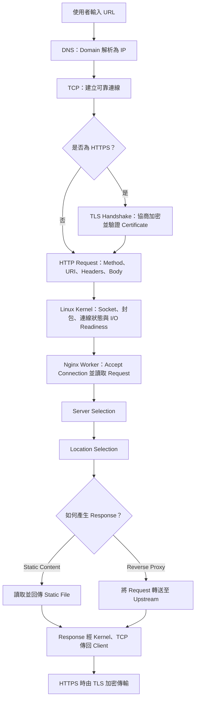
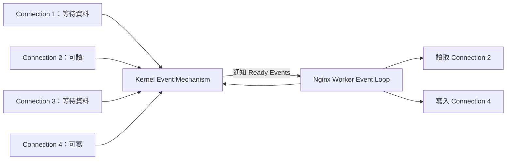
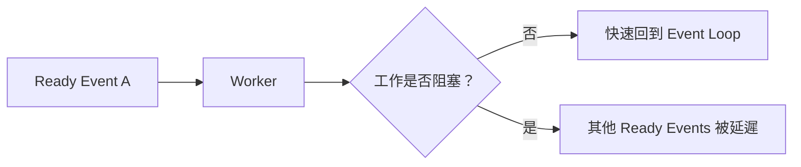
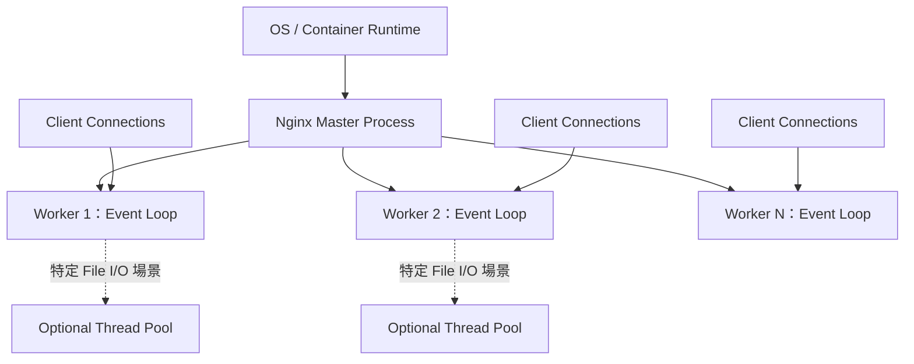
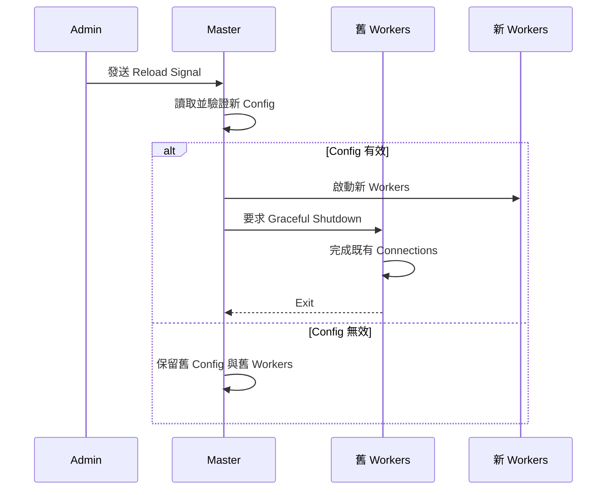

# Day 1 學習筆記

## Day 1：架構、Request Lifecycle 與 Config 骨架

### Hour 1：Client 到 Nginx

#### 學習目標

- 分辨 DNS、TCP、TLS、HTTP 與 Nginx 的責任邊界。
- 說明一個 HTTPS Request 在到達 Nginx HTTP 處理邏輯前發生什麼事。
- 分辨 Linux Kernel、Nginx Master 與 Worker 在連線處理中的角色。

#### Request Lifecycle 骨架



#### 責任邊界

| 元件 | 主要責任 |
|---|---|
| Client | 解析 URL、查 DNS、建立連線、送出 HTTP Request、處理 Response |
| DNS | 將 Domain Name 解析成可連線的 IP Address |
| Linux Kernel | Network Packet、TCP State、Socket、Listen/Accept Queue 與 I/O Readiness |
| Nginx Master | 讀取 Config、管理 Worker、Reload、Signal 與 Process Lifecycle |
| Nginx Worker | Accept Connection、讀取 Request、執行 HTTP Processing、寫回 Response |

#### 待實驗驗證

- [ ] 使用 DNS／Host 測試觀察 Name Resolution 與 HTTP Host 的差異。
- [x] 使用 `curl -v` 觀察 Connection 與 HTTP Request。
- [x] 啟動 Nginx Lab 後觀察 Master 與 Worker Processes。

#### 實驗一紀錄：`curl -v http://127.0.0.1:8080/`

| 觀察項目 | 實際值 | 所屬層次 |
|---|---|---|
| 連線目標 | `127.0.0.1:8080` | TCP |
| Request Line | `GET / HTTP/1.1` | HTTP |
| Method | `GET` | HTTP |
| URI | `/` | HTTP |
| Host Header | `127.0.0.1:8080` | HTTP |
| Response Status | `200 OK` | HTTP |
| Content-Type | `text/html` | HTTP |

關鍵結論：TCP 的連線目標與 HTTP `Host` Header 在本次實驗中內容相同，但它們屬於不同協定層，未來可以故意讓兩者不同。

#### 實驗二紀錄：相同 IP、不同 Host

執行的兩個 Requests：

```http
GET / HTTP/1.1
Host: a.local.test
```

```http
GET / HTTP/1.1
Host: unknown.local.test
```

兩次都連到相同的 `127.0.0.1:8080`，但 HTTP Host 不同。目前 Official Image 的 Config 沒有任何 `server_name` 匹配這兩個 Host，因此兩者都落入同一個 Default Server，最後由同一個 `root` 提供相同的 `index.html`。

關鍵因果：

```text
Host 沒有匹配
  -> 使用 Default Server
  -> 使用同一個 Location 與 Root
  -> 回傳相同內容
```

#### 實驗三紀錄：Master 與 Worker Processes

本次觀察到：

- 1 個 Master Process，PID 為 `395`。
- 8 個 Worker Processes，PID 為 `437` 至 `444`。
- 每個 Worker 的 PPID 都是 `395`，等於 Master PID。

範例讀法：

```text
PID  PPID  COMMAND
395  371   nginx: master process
437  395   nginx: worker process
```

`437` 是 Worker 自己的 PID；`395` 是它的 Parent PID，因此 Worker 是由 Master 管理的 Child Process。Master 自己的 PPID `371` 則是 Container 內啟動它的上層 Process。

Config 使用 `worker_processes auto;`，本次環境產生 8 個 Workers。這代表 Nginx 在目前執行環境偵測並採用了 8 個可用處理單位；不代表所有電腦都固定產生 8 個 Workers。

#### 實驗四紀錄：相同連線路徑，不同 HTTP 結果

```text
GET /           -> 200
GET /not-found  -> 404
```

兩個 Requests 都成功連到 `127.0.0.1:8080`，因此 `404` 不是 TCP Connection Failure。差異發生在 Nginx 解析 URI 並查找 Content 之後：`/` 有對應的 Index File，`/not-found` 沒有對應資源。

Hour 1 狀態：**完成**。

### Hour 2：Event-driven Concurrency

#### 核心問題

如果同時有 10,000 個 Clients 保持連線，但大部分時間都沒有資料可讀，Nginx 是否需要建立 10,000 個 Threads，讓每個 Thread 阻塞等待？

Nginx 的答案是：不需要。Worker 將 Connections 註冊到 Event Mechanism，只有 Connection 進入「可接受、可讀、可寫」等 Ready State 時，Kernel 才通知 Worker 處理。



#### 三個必要概念

| 概念 | 意義 |
|---|---|
| Event-driven | 依據 Connection 發生的 Event 決定下一步工作 |
| Non-blocking I/O | I/O 尚未 Ready 時，不讓 Worker 停在該 Connection 上等待 |
| Event Loop | Worker 反覆取得 Ready Events、處理少量工作，再回去等待下一批 Events |

Linux 上常見的 Event Mechanism 是 `epoll`。它的重點不是替 Nginx 處理 HTTP，而是有效率地告訴 Worker：「你關心的眾多 File Descriptors 中，哪些現在 Ready？」

#### 不要混淆

- Event-driven 不代表完全沒有 Processes 或 Threads。
- Non-blocking 不代表 Request 永遠不需要等待；而是等待期間 Worker 可以處理其他 Connections。
- epoll 不理解 HTTP、Location 或 Upstream；那些是 Nginx 的工作。
- Worker 數量少不代表同時只能服務少數 Connections。

#### 檢核題答案

有 10,000 個 Keepalive Connections、只有 3 個送來資料時，Worker 不需要逐一 Poll 全部 Connections。Linux Kernel 的 Event Mechanism（本課以 `epoll` 為例）會回報目前 Ready 的 File Descriptors，Worker 再處理對應的 3 個 Connections。

#### 實驗結果：單一 Worker 與慢速 Connections

實驗條件：

- `worker_processes 1;`
- 三個 TCP Connections 已建立，但沒有送出完整 HTTP Request。
- 第四個 Client 發送正常 HTTP Request。

實際結果：第四個 Request 仍立即取得 `200 OK`。

這與以下模型一致：

```text
三個 Connections 尚未有完整資料
  -> Worker 不阻塞等待
  -> Kernel 回報第四個 Connection 已 Ready
  -> 同一個 Worker 處理第四個 Request
  -> 回傳 200 OK
```

#### Event-driven 不是魔法

Worker 能服務大量等待中的 Connections，前提是每次被喚醒後執行的工作不長時間阻塞 Event Loop。如果 Worker 執行長時間 CPU-heavy 計算、Blocking File I/O 或不良 Third-party Module，該 Worker 仍可能暫時無法處理其他 Ready Events。



檢核結論：若唯一的 Worker 阻塞 5 秒，即使 Kernel 已回報其他 Ready Events，它們仍要等 Worker 回到 Event Loop。若有其他未阻塞 Workers，部分工作可能由其他 Workers 處理。

Hour 2 狀態：**完成**。

### Hour 3：Process Model

#### Process 關係



#### Master Process

- 讀取並驗證 Config。
- 建立、監督與終止 Workers。
- 接收 Reload、Reopen Logs、Quit、Terminate 等 Signals。
- Reload 時啟動使用新 Config 的 Workers，並要求舊 Workers Graceful Exit。
- 一般不負責逐一執行 HTTP Request Processing。

#### Worker Process

- 執行 Event Loop。
- Accept Connections。
- 讀取與解析 HTTP Requests。
- 執行 Server／Location／Module Processing。
- 讀取 Static Content 或與 Upstream 通訊。
- 寫回 Response。

#### Optional Thread Pool

Nginx 的核心模型仍是多個 Worker Processes，各自運行 Event Loop。Thread Pool 不是「每個 Connection 一條 Thread」，而是讓特定可能阻塞的 File I/O 工作有機會交由背景 Threads 執行，完成後再通知 Worker。

它不能自動修復所有 Blocking 問題，例如任意 Third-party Module 的 CPU-heavy 計算。

#### Reload 的新舊世代



#### 自我檢核

1. DNS 解析成功，是否代表 Nginx 一定會選到正確的 Server Block？
2. HTTPS 的 Certificate Error 發生時，Nginx 是否已經能回傳 HTTP Redirect？
3. Master Process 是否負責逐一處理每個 HTTP Request？
